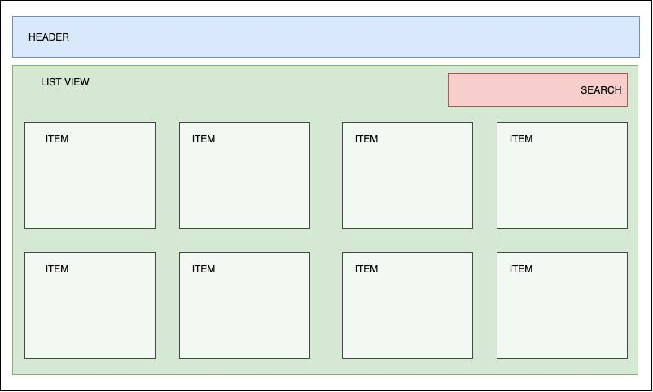
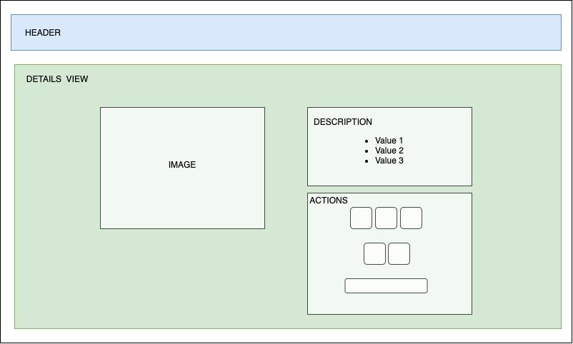

# Gadgetz   

Gadgetz is a small e-commerce site made in React's.js echosystem for a front-end technical interview. 

## Index

1. Project description
2. Platform overview
3. Scripts and Instalation
4. Comments

# Project description

 As mentioned in the introduction, Gadgetz is a small website made for purchasing smartphones online. It allows the user to view the latest products provided by an API, filter them by Brand and Model and see the details of each one of them too. Aditionally, the user must be able to add products to his or her cart and see the amount of items selected for purchase.

  The design its also part of the challenge, including adaptability to different resolutions and devices. 

# Platform overview 

It consists in two pages, one with the list of all the products and a limited scope of information about each product, and the other one is a detail page with full information and interaction capabilities.

## Product List Page

In this page the list of available products will be displayed, and the user will be able to see some of the information corresponding to each product, by clicking into an product's name, the user will be taken to the details page of the selected item

- Product List Page consist's in 3 main components:

Header

Searchbar

List / List Element

The Header includes the logo and breadcrumbs for the specified route the user is in.

Searchbar filters on real time the products that match the search's input value with the brand and model properties of each product

The list of products has a maximum of 4 columns and is responsive to multiple devices and resolutions, as for each item itself displays the following information:
    -Image of the product
    -Brand of the product
    -Model of the product
    -Price of the product

## Product Details Page

 This view lets the user see the details and interact with the product it self.
 It consists in two columns. 
 One for a full sized image of thje product, and the other one to display the detailed description of the product and actions you can perform with it. 

- Product Details page consists in 3 main components:

    Image

    Product Description

    Actions

-Image component displays the product's image

-Product's description component details the following information:
    
    Brand
    
    Model
    
    Price
    
     CPU
     
     RAM
     
     Operating sytem
     
     Screen Resolution
    
     Battery Specifications
     
     Camaras
     
     Size
     
     Weight

-Actions component lets the user choose among different options for the same product such as Storage and colour, also it lets the user add the selected product to the cart.

# Scripts and Instalation

to install, you'll need to have node.js (latest version recommended) installed. 
 Just clone the master branch of this repository and hit npm install.
 Aditionally there are 4 scripts included:

npm run START - run the app in development environment

npm run TEST  - run tests in the __tests__ folder

npm run LINT  - analyze code for bugs and stylistic errors

npm run BUILD - Creates a build directory with a production build of the app

# Comments

 Thanks to the company that sent me this challenge for letting me participate in the selection process of this position, will do my best.

